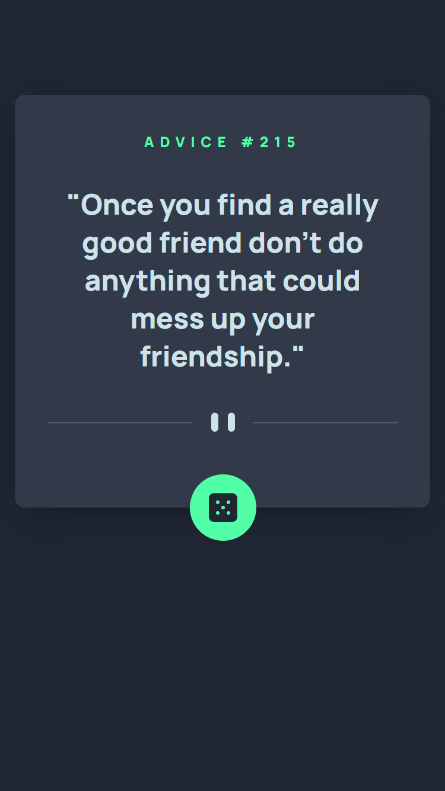
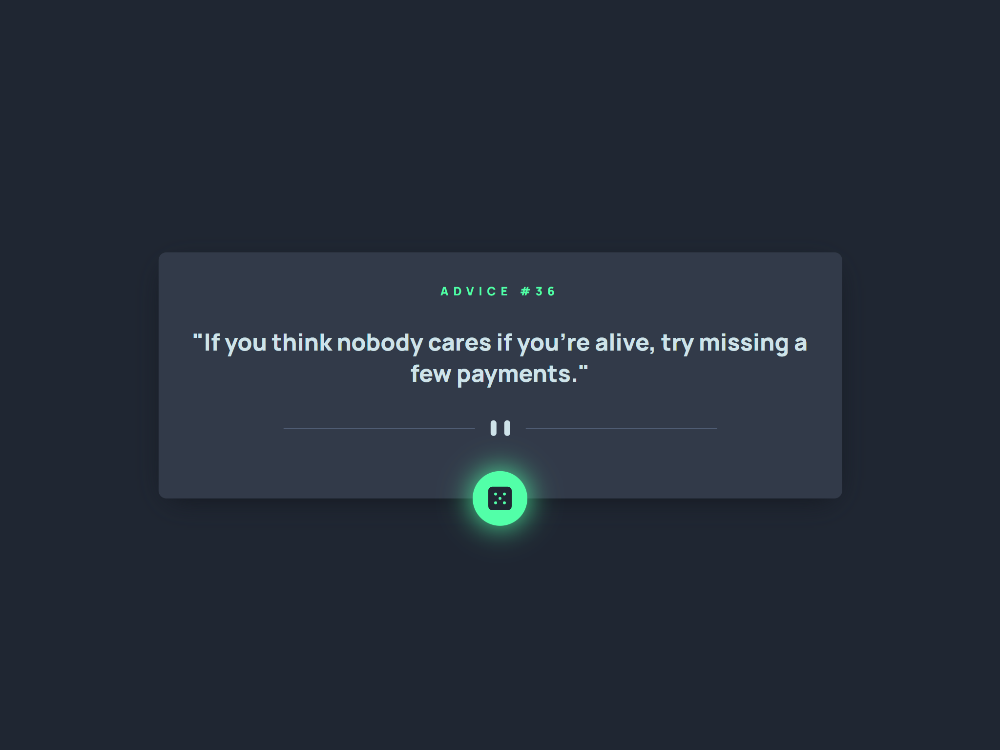

# Frontend Mentor - Advice generator app solution

Hi there!

Firstly, thank you for taking your time to review my project.

This is a solution to the [Advice generator app challenge on Frontend Mentor](https://www.frontendmentor.io/challenges/advice-generator-app-QdUG-13db).

## Table of contents

- [Overview](#overview)
- [Screenshot](#screenshot)
- [Built with](#built-with)

## Overview

Users should be able to:

- Generate a new piece of advice by clicking the dice icon.
- See loading and error states.
- See hover states for all interactive elements on the page.
- View the optimal layout for the app depending on their device's screen size.

## Screenshot

Mobile view:

Desktop view:

## Built with

- Tailwind
- TypeScript
- React.js
- Redux Toolkit
- Mobile-first workflow
